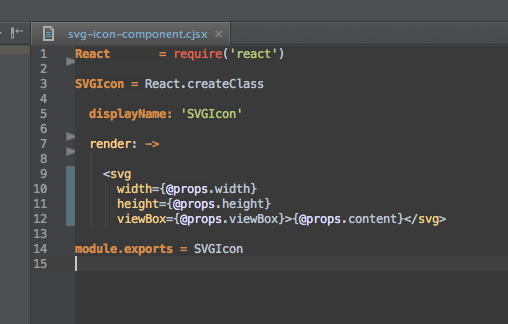

# cjsx.tmbundle

## Overview

CoffeeScript JSX (CJSX) Syntax support for JetBrains IDEs, such as WebStorm, PhpStorm, and Intellij IDEA. This plugin is a basic TextMate bundle which can be installed directly in WebStorm and provides syntax highlighting.

## Installation

Download the plugin release [here]().

Unzip the archive.

Follow the instructions [here](https://www.jetbrains.com/phpstorm/help/importing-textmate-bundles.html).

## Official IDE Support

Please vote for official support from JetBrains [on this ticket in YouTrack](https://youtrack.jetbrains.com/issue/WEB-12464).
